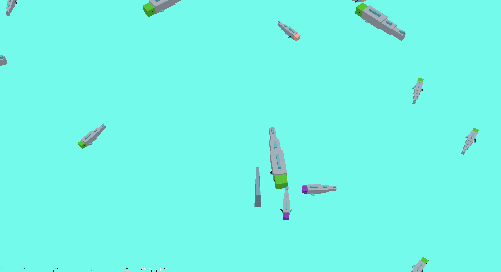

# Shark Simulator

Author: Zhijian Wang

Design: Control a shark and eat more fish!

Screen Shot:

How To Play:

In this game, the player controls a shark and eats fishes. Use W to move forward and use A and D to rotate the shark. There are fishes of different color and size, and larger fish gives more point (and you will get larger!). If you eat a fish, all other fishes of the color will be scared and run away. So don't lose the large fish for the small ones! Try to eat more fish in 60 seconds.

This game was built with [NEST](NEST.md).
